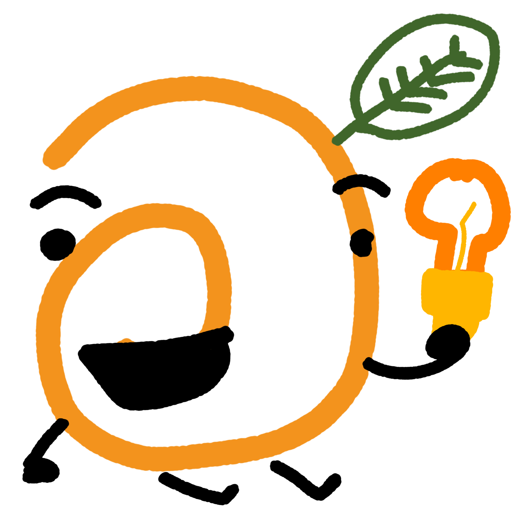

# Contributing to Ditto

We’re glad you’re here! Whether you're a seasoned developer or just someone who loves voxel engines, the Orange Mascot needs your help to grow Ditto into something special.

## 1. How to get started
* **Check the Issues:** Look for issues tagged with `good first issue` or `help wanted`. These are specifically designed for newcomers.
* **The Mascot States:** If you see the "Pondering Orange" (`md-assets/pic3.png`), it means we are actively investigating a bug. Feel free to jump in!
* **Join the Community:** [Link to your Discord Server] — ask questions here!

## 2. The Development Workflow
1. **Fork the repo** and clone it to your machine.
2. **Setup:** Ensure you have [LÖVE 11.4](https://love2d.org/) installed.
3. **Branching:** Please work on `feature/` or `fix/` branches—never push directly to `main`.
4. **Testing:** Before submitting a Pull Request (PR), make sure the engine still boots.

## 3. Coding Standards
* **Keep it "Hacker-Minimalist":** Don't add unnecessary bloat. If a task can be done in 10 lines of Lua instead of 100, do that.
* **Comment your code:** Especially for the rendering pipeline and the math-heavy shaders. 
* **No Global Pollution:** Avoid writing to `_G`. Encapsulate your logic in local tables.

## 4. Pull Request Process
* **Title:** Use a clear summary (e.g., `fix: resolve mascot rendering bug`).
* **Description:** Explain what you changed and why. If you’ve added a new "state" for the mascot, please include an image of it!
* **Review:** All PRs will be reviewed by the maintainers. We’re here to help you learn and improve!

## 5. Folder Structure
- `/src`: Core engine logic (Renderer, Input, Physics)
- `/lib`: Third-party libraries (e.g., CPML)
- `/assets`: Models (`.bbmodel`) and textures
- `/md-assets`: Mascot states and README imagery

### Current Status

  
  
<i>The Ditto Orange is ready to code!</i>

 

  <h3>Current Mascot Status</h3>
  
  
<i>The engine is currently investigating a new issue.</i>

